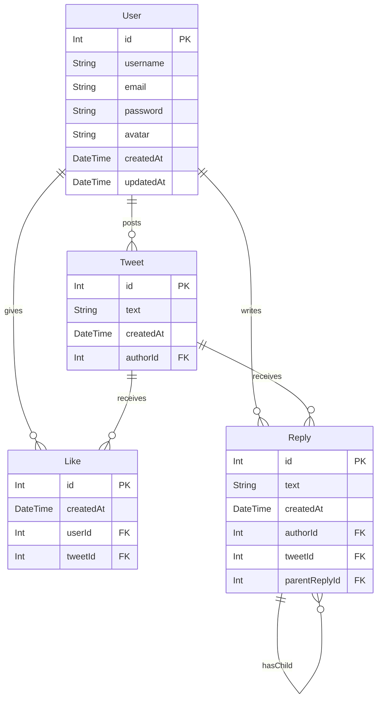

# Skybird

## Goals

Next.js Full Stack Mini Twitter Like Mobile Web App

## Libraries

- NextJS (App router), Prisma, Tailwind, ~~API~~Handle Routes, SWR, cloudflare

## TO-DO

[x] tailwind prettier 로 클래스 순서 맞추기
[x] page router 코드를 app router 코드로 변경하기
[x] Prisma와 PlanetScale 설치, 설정
[x] Custom User React Hook
[ ] iron-session state 처리 (User, Other, Logout)
[ ] useSWR 로 상태 변경 Optimistic UI Update
[ ] cloudflare connect
[ ] View Count, Like Count, Reply Count
[ ] Search Tweet
[ ] SVG Icons
[ ] Tailwind Group
[ ] Pagination (prisma `skip`/`take`)
[ ] geoLocation (custom hook)
[ ] image alt
[ ] Alert Component
[ ] Infinite Scroll
[ ] Reply to Reply
[ ] Oauth
[ ] Video, Link

## Structure

### View

(gate)

- Create-Account `/create-account` (C)
  - Form : Email, Username(Anonymous), Password, Password Confirm
  - Log-in
- Log-in `/log-in` (C)
  - Form : Email, Password
  - Create-Account
  - (todo) OAuth

(profile)

- Profile `/profile/[userId]`
  - Edit Profile `/profile/edit` (C)
    - Form : Profile Photo, Username, Description, Password
    - Remove Account : Confirm `/profile/remove-account`
  - Log-out : Confirm `/log-out` (C)
  - Liked Tweet List `/profile/[userId]/like`
  - Own Tweet List `/profile/[userId]/tweet`

(tweet)

- New Tweet `/new` Form : Text, Photo (C)
  - (todo) Video, Link, embed
- List : `/` User/Photo/Text/Timestamp/Likes&Reply Counts
  - Detail : `/tweet/[tweetId]` User/Photo/Text/Timestamp/Views
    - Reply (Form) : User/Text/Timestamp (C)
      - Enter to form reset
      - Reply Delete
      - Reply to Reply(Form) : _max 3 depths_
    - Like : Toggle _Optimistic UI Update_ (C)
    - Delete : Confirm (C)
- Search `/search` Form (C)
  - Search List

### Router Handler

(handler)

- `/list?page=1` list = page query (GET)
- `/list/search?page=1&keyword=` search query (GET)
- `/list/[userId]/tweet` list = page query (GET)
- `/list/[userId]/like` list = page query (GET)

- `/tweet/new`
- `/tweet/[tweetId]/view`
- `/tweet/[tweetId]/delete`
- `/tweet/[tweetId]/like`
- `/tweet/[tweetId]/reply`
- `/tweet/[tweetId]/reply/[replyId]/delete`
- (Todo) `/tweet/[tweetId]/reply/[replyId]/reply`

- `/user/new`
- `/user/login`
- `/user/[userId]/view`
- `/user/[userId]/edit`
- `/user/[userId]/delete`

## Database Flow

