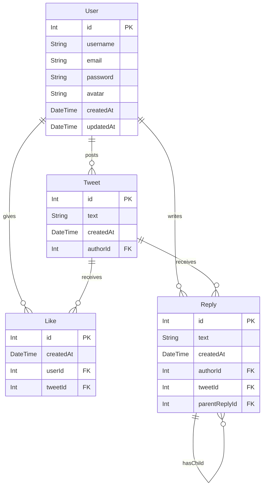

# Skybird

## Goals

Next.js Full Stack Mini Twitter App

## Libraries

- NextJS, Prisma, Tailwind, API Routes, SWR

## Structure

- /
  - See All Tweets, Log-in State
- /tweet/[id]
  - Like Button
- /create-account
- /log-in

## Doing

- tailwind prettier 로 클래스 순서 맞추기
- page router 코드를 app router 코드로 변경하기
- Prisma와 PlanetScale 설치, 설정
- Session 처리, Custom React Hook

## Database Flow

